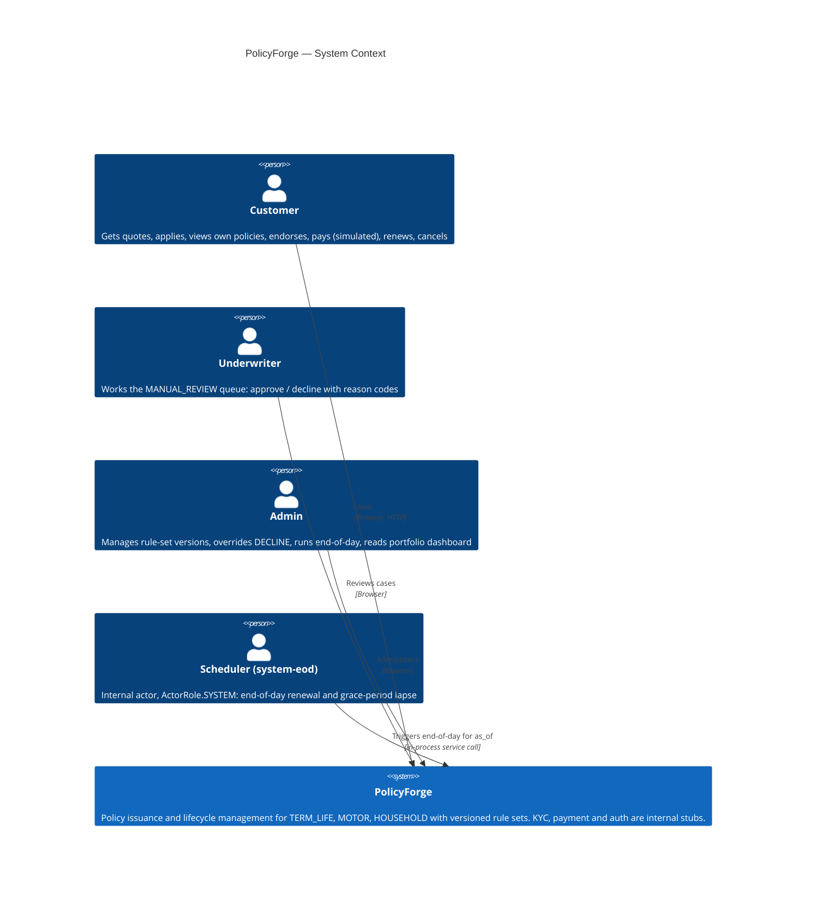
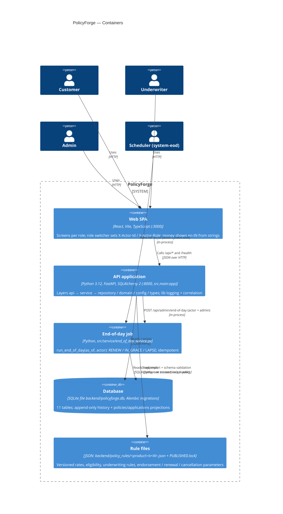

# PolicyForge — Architecture

PolicyForge is Horizon Insurance's (fictional) policy issuance and lifecycle platform for **Term Life, Motor
and Household**: quote → application → underwriting → issuance → endorsement → renewal / lapse →
cancellation, every figure computed from **versioned, immutable rule sets**.

| Related | |
|---|---|
| Canonical names, enums, error codes, formulas | `docs/conventions.md` |
| Components, data flows, decisions | `specs/design/system-design.md` |
| API (26 endpoints) | `specs/design/api-contracts.md`, `specs/design/api-contracts.schema.json` |
| Environments, CI, rollback | `specs/design/deployment.md` |
| Layer rules for agents/hooks | `.claude/architecture.md` |
| Decisions | `docs/decisions.md` (DEC-001 stack, DEC-009 draft replace, DEC-010 `ActorRole.SYSTEM`) |

---

## 1. Layered structure

The backend (`backend/src/`, imported as `src.<layer>`) is a strict one-way layered architecture. In the
classic vocabulary: **controllers = `api`**, **services = `service`**, **repositories = `repository`**,
**domain = `domain`**, plus a bottom **`types`** layer, a **`config`** layer and a cross-cutting, standard-library-only
**`lib`**.

```
             ┌──────────────────────────────────────────────────────────────┐
  UI         │ frontend/ (React + Vite + TS) — talks to the API over HTTP   │
             └──────────────────────────────┬───────────────────────────────┘
                                            │ HTTP/JSON, X-Actor-Id / X-Actor-Role / X-Correlation-ID
             ┌──────────────────────────────▼───────────────────────────────┐
  api        │ CONTROLLERS  src/api/routers/<resource>.py, deps.py,          │
             │              middleware.py — auth stub, role checks, DTOs,    │
             │              typed error → HTTP mapping                       │
             ├──────────────────────────────────────────────────────────────┤
  service    │ SERVICES     src/service/<use_case>_service.py — use cases,   │
             │              transactions, audit rows, state-machine calls    │
             ├──────────────────────────────────────────────────────────────┤
  repository │ REPOSITORIES src/repository/models.py, <entity>_repository.py │
             │              — SQLAlchemy 2; append-only repos: add + reads   │
             ├──────────────────────────────────────────────────────────────┤
  config     │ src/config/settings.py, rule_loader.py (file/body → RuleSet)  │
             ├──────────────────────────────────────────────────────────────┤
  domain     │ DOMAIN       src/domain/*.py — pure Decimal rules: premium,   │
             │              validation, underwriting, state machine,         │
             │              endorsement, renewal, refund (no I/O/log/clock)  │
             ├──────────────────────────────────────────────────────────────┤
  types      │ src/types/enums.py, errors.py, rules.py                       │
             └──────────────────────────────────────────────────────────────┘
  lib (cross-cutting, stdlib only): src/lib/logging.py (get_logger, mask_pii), src/lib/correlation.py
```

### 1.1 Import rules (verbatim from `docs/conventions.md`)

| Layer | May import | Must not import |
|-------|-----------|-----------------|
| `types` | nothing | everything else, incl. `lib` |
| `domain` | `types` | `config`, `repository`, `service`, `api`, **`lib`**, I/O, clock |
| `config` | `types`, `domain`, `lib` | `repository`, `service`, `api` |
| `repository` | `types`, `config`, `lib` | `domain`, `service`, `api` |
| `service` | `types`, `domain`, `config`, `repository`, `lib` | `api`, `fastapi` |
| `api` | `types`, `config`, `service`, `lib` | **`repository`**, `domain` |
| `lib` | standard library only | every `src.*` layer |

Consequences:

- **Auth lives only in controllers** (`src/api/deps.py`): services receive an actor id/role, never headers
  (NFR-04, AC-22).
- **Domain is pure**, so premium and underwriting results are deterministic functions of `(RuleSet, inputs,
  dates)` (AC-01, NFR-08). Services pass the business date in.
- **Controllers never touch the database**; they call services, which own transactions.
- Typed errors (`src/types/errors.py`, e.g. `InvalidPolicyStateException`) are raised below and mapped to the
  error envelope once, at the API boundary.

### 1.2 Enforcement

`import-linter` contracts (`uv run lint-imports`, CI `backend-test`), `backend/tests/architecture/` (E1-S4),
and the `check-architecture` / `pre-commit-gate` hooks.

---

## 2. C4 — System context

No real external systems: KYC, payments and authentication are **internal stubs** (BRD §10, brief §6.3).



---

## 3. C4 — Containers



---

## 4. Sequence — quote to bind

Quote → application (automatic underwriting) → optional underwriter decision → issue policy. Shows the
active-rule-version lookup, `Decimal` premium, append-only decision/transition/payment rows and audit rows.

```mermaid
sequenceDiagram
  autonumber
  actor C as Customer (cust-001)
  actor U as Underwriter (uw-001)
  participant API as api (routers + deps)
  participant QS as quote_service
  participant AS as application_service
  participant US as underwriting_service
  participant IS as issuance_service
  participant D as domain (pure)
  participant R as repositories
  participant DB as SQLite

  C->>API: POST /api/quotes {product: MOTOR, inputs}
  API->>API: deps: X-Actor-Id / X-Actor-Role → Actor(CUSTOMER) else 401/403
  API->>QS: create_quote(actor, product, inputs)
  QS->>R: active version = highest PUBLISHED rule_set_versions row
  R->>DB: SELECT rule_set_versions
  alt no PUBLISHED version
    QS-->>API: NoPublishedVersionError → 409 NO_PUBLISHED_VERSION
  end
  QS->>D: application_validator.validate(RuleSet v1, inputs)
  QS->>D: premium_calculator.premium(RuleSet v1, inputs)
  Note over D: Decimal only: 500000.00 × 0.0310 × 1.00 × 1.10 × 1.05 × 0.80 = 14322.00<br/>max(raw, minimum_premium), quantize(0.01, ROUND_HALF_UP) once
  QS->>R: quotes.add(product, rule_version=1, inputs, premium)
  API-->>C: 201 {quote_id, rule_version: 1, premium: "14322.00"}

  C->>API: POST /api/applications {quote_id, kyc, health_declaration?}
  API->>AS: submit(actor, quote_id, kyc)
  AS->>R: load quote (owner check → 404) and active version
  alt quote.rule_version ≠ active
    AS-->>API: 409 QUOTE_STALE
  end
  AS->>D: validate KYC + eligibility; mask_pii → aadhaar_masked / pan_masked
  AS->>D: underwriting_rules.decide(RuleSet v1, inputs) → AUTO_BIND | MANUAL_REVIEW | DECLINE + reason codes
  AS->>R: applications.add(SUBMITTED → UNDERWRITING → outcome)<br/>underwriting_decisions.add(decided_by=SYSTEM, rule_version=1)
  API-->>C: 201 {status, decision, reason_codes} (golden quote, vehicle age 3 → AUTO_BIND, [])

  opt MANUAL_REVIEW (e.g. vehicle_age_years > 10 → MO-UW-002)
    U->>API: POST /api/underwriting/applications/{id}/decision {APPROVE, [MO-UW-900], comment}
    API->>US: decide(actor uw-001, id, APPROVE, codes)
    US->>R: underwriting_decisions.add(AUTO_BIND, decided_by=uw-001)<br/>application → AUTO_BIND<br/>audit_records.add(UW_APPROVE, uw-001, UNDERWRITER)
    API-->>U: 200 {status: AUTO_BIND}
  end

  C->>API: POST /api/applications/{id}/issue
  API->>IS: issue(actor, id, business_date)
  IS->>D: policy_state_machine.transition(None → ACTIVE)
  rect rgb(240,240,240)
    Note over IS,DB: one transaction
    IS->>R: allocate MO-2026-000123; policies.add(ACTIVE, premium 14322.00, rule_version 1)
    IS->>R: policy_state_transitions.add(null → ACTIVE, reason ISSUED)
    IS->>R: premium_payments.add(due_date = effective_date, amount = premium)
    IS->>R: application → ISSUED; audit_records.add(POLICY_ISSUED) only if ADMIN
  end
  API-->>C: 201 {policy_number: MO-2026-000123, status: ACTIVE, next_premium_due_date}
```

---

## 5. Sequence — end-of-day renewal / lapse

```mermaid
sequenceDiagram
  autonumber
  actor A as Admin (admin-001) or Scheduler (system-eod)
  participant API as api /api/admin/end-of-day
  participant E as end_of_day_service
  participant D as domain renewal_rules + premium_calculator + state machine
  participant R as repositories / SQLite

  A->>API: POST {as_of: 2026-10-01} (Admin); the scheduler calls the service directly as system-eod / SYSTEM
  API->>E: run_end_of_day(as_of, actor)
  E->>R: policies with status ACTIVE or ENDORSED
  loop each policy (own transaction)
    E->>D: renewal_action(policy, paid?, as_of, grace_period_days) → RENEW | IN_GRACE | LAPSE | NONE
    alt RENEW (renewal premium paid, as_of ≥ expiry + 1)
      E->>D: transition(ACTIVE|ENDORSED → RENEWED)
      E->>R: policies.add(successor ACTIVE, previous_policy_number unique, premium + rule_version from payment)
      E->>R: transitions.add(old → RENEWED), transitions.add(null → ACTIVE)
    else LAPSE (unpaid, as_of > due + grace)
      E->>D: transition(→ LAPSED)
      E->>R: transitions.add(→ LAPSED, reason GRACE_PERIOD_EXPIRED)
    else IN_GRACE / NONE / not renewable
      Note over E: no change (counted)
    end
    opt failure
      E->>E: rollback this policy, JSON log (correlation id, policy number, no PII), add to failed
    end
  end
  E->>R: audit_records.add(RUN_END_OF_DAY, actor, detail = as_of + counts)
  API-->>A: 200 {renewed, lapsed, in_grace, not_renewable, failed, ...}
  Note over E,R: Re-run for the same as_of finds only terminal / unchanged policies → renewed 0, lapsed 0 (AC-18)
```

---

## 6. How NFR-01 … NFR-08 are enforced

Three lines of defence: **hooks** (block bad edits as Claude writes them), **architecture and AC tests** (fail
the build), **CI** (runs everything on every MR, plus a read-only Claude review).

| NFR | Requirement | Hooks (`.claude/hooks/`, `.claude/settings.json`) | Tests | CI |
|-----|-------------|------------------------------------------------|-------|----|
| **NFR-01** Fixed-point money | `Decimal` / `Numeric(12, 2)`, quantize 0.01 `ROUND_HALF_UP` once; no `float` | `premium-precision-check` (PreToolUse Write/Edit on `backend/src/`, `backend/migrations/`) | Arch test scanning `src/domain`, `src/types` and money modules for `float`; golden premium/refund tests incl. `3000.625 → 3000.63`; `/quote-check` | `backend-test`, `hook-selftest` |
| **NFR-02** Append-only history | 8 append-only tables never `UPDATE`/`DELETE`; PUBLISHED rule files never change | `append-only-repository-check`, `policy-immutability-check`, `shell-immutability-check` (Bash) | Arch test: append-only repositories expose only `add` + reads; before-flush guard tests; `PUBLISHED.lock` re-hash test | `backend-test`, `hook-selftest` |
| **NFR-03** No PII in logs | Aadhaar, PAN, health declarations never logged; masked display | `pii-redaction-check` (logging/print/console calls in backend + frontend) | Log-capture tests with `999900000001` / `AAAAA0001A` (AC-23); `mask_pii` unit tests | `backend-test`, `claude-review` |
| **NFR-04** Auth boundary + audit | Role checks in `src/api/deps.py`; audit row per UNDERWRITER/ADMIN/`system-eod` action | `check-architecture` (service/domain must not import `fastapi`/api) | 401/403 tests on every protected route (AC-22); audit-row tests (AC-09, AC-11, AC-14); arch test that every router declares a role dependency | `backend-test`, `e2e-test` |
| **NFR-05** Append-only migrations | Alembic revisions in `backend/migrations/versions/` only added; rule changes = new `v<N>.json` + `PUBLISHED.lock` line | `policy-immutability-check`, `shell-immutability-check` | Arch test diffing migrations against `git merge-base HEAD origin/$CI_DEFAULT_BRANCH`; `PUBLISHED.lock` re-hash; `migration-coherence-agent` | `backend-test` |
| **NFR-06** Structured logs | JSON lines with `timestamp`, `level`, `logger`, `message`, `correlation_id`; `X-Correlation-ID` on every response | `pii-redaction-check` (routes logging through `src/lib/logging.py`) | Middleware tests (echo / generate UUID4, error responses too); `json.loads` on every captured line (AC-23) | `backend-test` |
| **NFR-07** Health | `GET /health` 200 `{"status": "ok"}` < 1 s after startup, unauthenticated | — | Startup test (AC-21); Playwright smoke in `/evaluate` | `backend-test`, `e2e-test` |
| **NFR-08** Architecture as tests | Layer rules, pure domain, no `float`, immutable published versions fail the build | `check-architecture` (PostToolUse), `pre-commit-gate` | import-linter contracts + `backend/tests/architecture/` (E1-S4) | `backend-test` (`lint-imports`, `pytest`) |

Traceability: every `AC-NN` has ≥ 1 test `test_acNN_*` with `@pytest.mark.ac("AC-NN")` (or `AC-NN` in a
Playwright title); `/ac-coverage` writes `specs/reviews/ac-coverage.md`.
