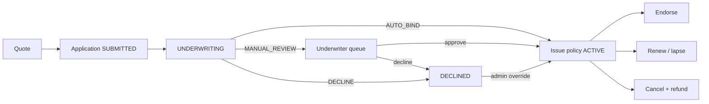
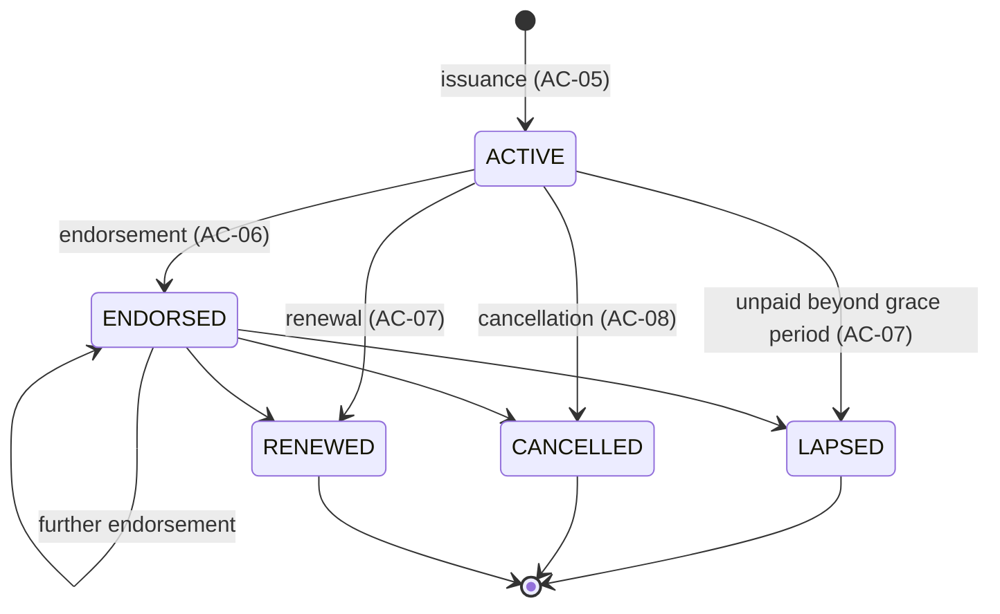

# PolicyForge — Root Specification

| | |
|---|---|
| **Source** | Approved BRD `specs/brd/brd.md` · brief `problem.txt` §5–§6 · business case `docs/business-case.md` |
| **Skeleton** | `specs/stories/dependency-graph.md` (authoritative AC ids, ownership, epics, stories) |
| **Canonical names** | `docs/conventions.md` (used verbatim here) |
| **Owns** | AC-20, AC-21, AC-22, AC-23, AC-24 and the cross-cutting NFR-01 … NFR-08 |

Spec is truth: if this file and the code disagree, this file wins. AC ids are global and stable — never renumber.

## 1. Purpose

PolicyForge is Horizon Insurance's (fictional) policy issuance and lifecycle management platform. It runs
**quote → application → underwriting → issuance → endorsement → renewal / lapse → cancellation** on a single
system. Every premium, eligibility check, underwriting decision and refund is computed from a **versioned,
immutable product rule set**, so rates and rules change without code changes and every past quote and policy
stays reproducible. Money is fixed-point, history is append-only, underwriter/admin actions are audited and PII
never reaches logs.

## 2. Products

| Product | Code | Rule files | Reason-code prefix | Term |
|---------|------|------------|--------------------|------|
| Term Life | `TERM_LIFE` | `backend/policy_rules/term_life/v<N>.json` | `TL-UW-###` | 5–30 years chosen at quote, annual premium |
| Motor | `MOTOR` | `backend/policy_rules/motor/v<N>.json` | `MO-UW-###` | 12 months (`renewal.term_months`) |
| Household | `HOUSEHOLD` | `backend/policy_rules/household/v<N>.json` | `HH-UW-###` | 12 months (`renewal.term_months`) |

Rule files follow `backend/policy_rules/schema/rule-file.schema.json`; published files are recorded in the
append-only ledger `backend/policy_rules/PUBLISHED.lock`. Currency is INR (`en-IN` formatting in the UI).
Details: [product-catalog_spec.md](product-catalog_spec.md).

## 3. Actors and roles

Authentication is a documented **role-header auth stub** enforced at the controller (API) layer:
`X-Actor-Id` (opaque id, e.g. `cust-001`, `uw-001`, `admin-001`) and `X-Actor-Role`
(`CUSTOMER` | `UNDERWRITER` | `ADMIN`, enum `ActorRole`). The UI header role switcher sets these headers for
three demo users.

| Actor | `ActorRole` | Can do |
|-------|-------------|--------|
| Customer | `CUSTOMER` | Quote, apply, view **own** policies, request endorsements, pay (simulated), renew, cancel |
| Underwriter | `UNDERWRITER` | Work the `MANUAL_REVIEW` queue: approve / decline with reason codes (audited) |
| Admin | `ADMIN` | Manage rule-set versions (draft → publish), review the queue and override `DECLINE` (audited), portfolio dashboard, run end-of-day |
| System scheduler | (internal, actor id `system-eod`) | End-of-day renewal and grace-period lapse processing |

## 4. Lifecycle overview

### 4.1 Journey



### 4.2 Policy state machine (`PolicyStatus`)



`LAPSED`, `CANCELLED`, `RENEWED` are terminal; renewal issues a **new term policy** that starts `ACTIVE`.
Any other transition raises `InvalidPolicyStateException` (`src/types/errors.py`) → HTTP 409, no change (AC-10).
Every transition is appended to `policy_state_transitions`.

### 4.3 Application status (`ApplicationStatus`)

`SUBMITTED → UNDERWRITING → AUTO_BIND | MANUAL_REVIEW | DECLINED → ISSUED`;
`MANUAL_REVIEW → AUTO_BIND | DECLINED`; admin override `DECLINED → AUTO_BIND`.
`Decision` enum: `AUTO_BIND`, `MANUAL_REVIEW`, `DECLINE`.

## 5. Architecture summary

| Layer | Path | May import | Notes |
|-------|------|-----------|-------|
| Types | `backend/src/types/` | nothing | enums, typed errors, `RuleSet` value objects |
| Domain | `backend/src/domain/` | types | pure Decimal rules: premium, validation, underwriting, state machine, endorsement, renewal, refund — no I/O, logging or clock |
| Config | `backend/src/config/` | types, domain, lib | settings, `rule_loader.py` (file → `RuleSet`, schema validation) |
| Repository | `backend/src/repository/` | types, config, lib | SQLAlchemy 2 models; append-only repos expose `add(...)` + reads only |
| Service | `backend/src/service/` | types, domain, config, repository, lib | use cases, transactions, audit |
| API | `backend/src/api/` | types, config, service, lib (not repository) | FastAPI routers under `/api`, auth stub, middleware |
| UI | `frontend/` | API over HTTP | React + Vite + TypeScript |
| lib | `backend/src/lib/` | standard library only | `get_logger`, `mask_pii`, correlation id |

Stack: Python 3.12, FastAPI, SQLAlchemy 2, Alembic, SQLite, uv; React, Vite, TypeScript; pytest, import-linter,
ruff, mypy strict, vitest, Playwright. Single command `npm start` installs, migrates, seeds (3 products + sample
policies) and starts API on `:8000` and UI on `:3000`. Entry point `src.main:app`; seed `python -m src.seed`.

### 5.1 Common API conventions

- All routes under `/api`; `GET /health` is the only un-prefixed route. The **API endpoints** table in
  `docs/conventions.md` is authoritative for paths and roles until `specs/design/api-contracts.md` (from `/design`)
  supersedes it.
- Money is serialised as a JSON **string** with two decimals (e.g. `"14322.00"`), never a JSON number.
- Error envelope for every non-2xx response:
  `{"error": {"code": "<SCREAMING_SNAKE>", "message": "<text>", "details": [{"field": "<name>", "code": "<SCREAMING_SNAKE>"}]}}`
  (`details` is the field list for 422, otherwise an object or `null`); the correlation id is in the
  `X-Correlation-ID` header. Codes (`docs/conventions.md` → Error codes): `VALIDATION_ERROR` 422, `UNAUTHENTICATED`
  401, `FORBIDDEN` 403, `NOT_FOUND` 404 (also another customer's resource), `NO_PUBLISHED_VERSION`,
  `VERSION_IMMUTABLE`, `DRAFT_ALREADY_OPEN`, `INVALID_POLICY_STATE`, `INVALID_APPLICATION_STATE`, `QUOTE_STALE`,
  `PREMIUM_ALREADY_PAID`, `OUTSIDE_RENEWAL_WINDOW` 409.

## 6. Cross-cutting non-functional requirements

| NFR | Testable requirement | Verified by |
|-----|---------------------|-------------|
| **NFR-01** Fixed-point money | Every premium, premium delta, refund, admin fee, payment and sum insured is `decimal.Decimal` in Python and `Numeric(12, 2)` in the DB (rates `Numeric(9, 6)`); final amounts are quantized to `0.01` with `ROUND_HALF_UP`; no `float` appears in `src/domain/`, `src/types/` or any money path; rule-file money/rates are JSON strings. | Hook `premium-precision-check`; architecture test in `backend/tests/architecture/` scanning for `float` in domain/types/money modules; golden premium/refund tests with a half-up boundary case (e.g. HOUSEHOLD `3000.625 → 3000.63`, E3-S1); `/quote-check`. |
| **NFR-02** Append-only history | `rule_set_versions`, `underwriting_decisions`, `underwriting_overrides`, `policy_state_transitions`, `endorsements`, `premium_payments`, `refunds`, `audit_records` never receive `UPDATE` or `DELETE`; their repositories expose `add(...)` + reads only. `PUBLISHED` rule files never change. | Hooks `append-only-repository-check`, `policy-immutability-check`; architecture test asserting append-only repositories define no update/delete methods; repository tests; `PUBLISHED.lock` hash test. |
| **NFR-03** No PII in logs | Aadhaar, PAN and health declarations never appear in any log line; logging goes only through `src/lib/logging.py` (`get_logger`, `mask_pii`); UI displays masked forms Aadhaar `XXXX-XXXX-0001`, PAN `XXXXX0001X`. | Hook `pii-redaction-check`; tests that submit synthetic Aadhaar `999900000001` / PAN `AAAAA0001A` and assert captured logs contain neither (AC-23). |
| **NFR-04** Auth boundary + audit | Role checks happen in API dependencies (`src/api/deps.py`), not in services; every underwriter/admin mutating action writes one `audit_records` row with `actor_id`, `actor_role`, action, entity id and timestamp. | API tests for 401/403 on every protected route (AC-22); service tests asserting audit rows with the `docs/conventions.md` actions (AC-09, AC-14, AC-11); architecture test that routers declare a role dependency. |
| **NFR-05** Append-only migrations | Alembic revisions in `backend/migrations/versions/` are only ever added, never edited or deleted once merged; policy-rule migrations are new `v<N>.json` files + new `PUBLISHED.lock` lines. | Hooks `policy-immutability-check`, `shell-immutability-check`; `migration-coherence-agent`; architecture test recomputing `PUBLISHED.lock` hashes. |
| **NFR-06** Structured logs | Every log line is one JSON object with at least `timestamp`, `level`, `logger`, `message`, `correlation_id`; every response carries `X-Correlation-ID` (echoed if supplied, UUID4 generated otherwise). | Middleware tests (AC-23); log-capture test parsing each line with `json.loads`. |
| **NFR-07** Health | `GET /health` returns `200 {"status": "ok"}` within 1 s of a successful startup, unauthenticated. | Startup test (AC-21); Playwright smoke in `/evaluate`. |
| **NFR-08** Architecture as tests | Layer import rules (§5), pure domain (no `lib`, I/O, clock), no `float` in premium code and immutable published versions are enforced by automated tests that fail the build. | import-linter contracts + `backend/tests/architecture/` (E1-S4); run in CI `test` stage. |

## 7. Acceptance criteria index (AC-01 … AC-24)

| AC | Criterion (short) | Owning spec | Stories |
|----|-------------------|-------------|---------|
| AC-01 | Deterministic premium for product + insured profile from the active versioned rule file | [quote-engine](quote-engine_spec.md) | E3-S1, E3-S2 |
| AC-02 | ≥ 3 products (TERM_LIFE, MOTOR, HOUSEHOLD) with distinct rule sets | [product-catalog](product-catalog_spec.md) | E2-S1, E2-S2 |
| AC-03 | Application captures KYC stub + risk inputs, validates vs product rules, progresses to underwriting | [underwriting](underwriting_spec.md) | E4-S1, E4-S2 |
| AC-04 | Underwriting returns AUTO_BIND / MANUAL_REVIEW / DECLINE with reason codes from the active version | [underwriting](underwriting_spec.md) | E4-S1, E4-S2 |
| AC-05 | Issuance: unique policy number, effective date, sum insured, premium, status ACTIVE | [policy-issuance](policy-issuance_spec.md) | E5-S2 |
| AC-06 | Endorsement: immutable record linked to policy + atomic policy attribute update | [endorsement](endorsement_spec.md) | E6-S2 |
| AC-07 | Renewal: new term with refreshed premium; auto-lapse when unpaid beyond grace period | [renewal-cancellation](renewal-cancellation_spec.md) | E7-S1, E7-S3 |
| AC-08 | Cancellation: pro-rated refund per product rules; status CANCELLED; refund append-only | [renewal-cancellation](renewal-cancellation_spec.md) | E8-S1, E8-S2 |
| AC-09 | Admin reviews the manual queue and overrides DECLINE with reason code + comment; audited | [underwriting](underwriting_spec.md) | E4-S4 |
| AC-10 | ACTIVE → ENDORSED / LAPSED / CANCELLED / RENEWED enforced; invalid → `InvalidPolicyStateException` | [policy-issuance](policy-issuance_spec.md) | E5-S1 |
| AC-11 | Admin creates a DRAFT version and publishes it; PUBLISHED versions are immutable; only one active version per product | [product-catalog](product-catalog_spec.md) | E2-S3 |
| AC-12 | Invalid quote input → 422 with field errors; no PUBLISHED version → quote refused (no fallback) | [quote-engine](quote-engine_spec.md) | E3-S2 |
| AC-13 | Every quote records product + rule version; re-quoting the same input on that version reproduces the premium | [quote-engine](quote-engine_spec.md) | E3-S2 |
| AC-14 | Underwriter approves/declines a MANUAL_REVIEW case with reason codes; decision audited with actor ID | [underwriting](underwriting_spec.md) | E4-S3 |
| AC-15 | Customer sees own policies with premium due date, lifecycle status and endorsement history | [policy-issuance](policy-issuance_spec.md) | E5-S3 |
| AC-16 | Endorsement types CHANGE_ADDRESS / ADD_NOMINEE / CHANGE_SUM_INSURED validated vs rule set; sum-insured change recomputes premium delta | [endorsement](endorsement_spec.md) | E6-S1 |
| AC-17 | Simulated premium payment is recorded append-only; a paid policy does not lapse | [renewal-cancellation](renewal-cancellation_spec.md) | E7-S2 |
| AC-18 | End-of-day run is idempotent: re-running for the same date renews/lapses nothing twice | [renewal-cancellation](renewal-cancellation_spec.md) | E7-S3 |
| AC-19 | Cancellation within the free-look period refunds the full premium; afterwards pro-rata minus admin fee | [renewal-cancellation](renewal-cancellation_spec.md) | E8-S1 |
| AC-20 | Admin dashboard: active policies by product, premium collected, renewal pipeline, lapse forecast | [app_spec](#acceptance-criteria) | E9-S1, E9-S2 |
| AC-21 | `GET /health` returns 200 within 1 s of startup | [app_spec](#acceptance-criteria) | E1-S1 |
| AC-22 | API enforces roles at the controller layer: missing actor → 401, wrong role → 403 | [app_spec](#acceptance-criteria) | E1-S3 |
| AC-23 | Every response echoes `X-Correlation-ID`; logs are JSON lines with it and contain no PII | [app_spec](#acceptance-criteria) | E1-S2 |
| AC-24 | UI is responsive: usable at 1280 px and 390 px (nav collapses, tables stack) | [app_spec](#acceptance-criteria) | E1-S5, E9-S4 |

Traceability rule: every AC has ≥ 1 test named `test_acNN_*` carrying `@pytest.mark.ac("AC-NN")` (or `AC-NN` in a
Playwright `test(...)` title). The gate report is `specs/reviews/ac-coverage.md` from `/ac-coverage`.

## 8. Feature specs

| Spec | Owns | Epics |
|------|------|-------|
| [product-catalog_spec.md](product-catalog_spec.md) | AC-02, AC-11 | E2 |
| [quote-engine_spec.md](quote-engine_spec.md) | AC-01, AC-12, AC-13 | E3 |
| [underwriting_spec.md](underwriting_spec.md) | AC-03, AC-04, AC-09, AC-14 | E4 |
| [policy-issuance_spec.md](policy-issuance_spec.md) | AC-05, AC-10, AC-15 | E5 |
| [endorsement_spec.md](endorsement_spec.md) | AC-06, AC-16 | E6 |
| [renewal-cancellation_spec.md](renewal-cancellation_spec.md) | AC-07, AC-08, AC-17, AC-18, AC-19 | E7, E8 |
| this file | AC-20 … AC-24 | E1, E9 |

## 9. Root-owned API endpoints

| Method | Path | Roles | Success | Errors |
|--------|------|-------|---------|--------|
| GET | `/health` | none (public) | 200 `{"status": "ok"}` | — |
| GET | `/api/admin/portfolio?as_of=YYYY-MM-DD` | `ADMIN` | 200 portfolio summary | 401, 403, 422 malformed `as_of` |

Portfolio summary (`as_of` = business date, default today; `W` = `renewal_window_days` = 30):
`{"as_of": "2026-10-15", "active_by_product": {"TERM_LIFE": n, "MOTOR": n, "HOUSEHOLD": n}, "premium_collected": "<money>", "refunds_paid": "<money>", "renewal_pipeline": [{"policy_number", "product", "due_date", "renewal_premium", "paid"}], "lapse_forecast": {"count": n, "premium_at_risk": "<money>", "policies": [{"policy_number", "product", "due_date", "grace_end_date", "premium"}]}}`

- **Active policies** = policies with status `ACTIVE` or `ENDORSED`; all three product codes always listed.
- **Premium collected** = sum of `premium_payments.amount` (first-term payments recorded at issuance + renewal
  payments). **Refunds paid** = sum of `refunds.amount`.
- **Renewal pipeline** = `ACTIVE`/`ENDORSED` policies whose renewal due date (`expiry_date + 1 day`) falls in
  `(as_of, as_of + W]`, with a `paid` flag.
- **Lapse forecast** = `ACTIVE`/`ENDORSED` policies with the renewal premium unpaid and in grace whose grace end
  (`due_date + renewal.grace_period_days`) falls in `[as_of, as_of + W]` — they lapse at end of grace unless paid.

Data read: `policies`, `premium_payments`, `refunds`, `rule_set_versions` (canonical tables, `docs/conventions.md`).

## 10. Assumptions

- Business date defaults to the server's local date; tests inject it (domain never reads the clock).
- Demo users: `cust-001` (CUSTOMER), `uw-001` (UNDERWRITER), `admin-001` (ADMIN). Synthetic data only.
- Renewal pipeline and lapse-forecast look-ahead use `renewal_window_days` (default 30) from `src/config/settings.py`.

## Acceptance Criteria

### AC-20 — Admin portfolio dashboard shows active policies by product, premium collected, renewal pipeline and lapse forecast

Premiums below are computable from the E2-S1 v1 values: TERM_LIFE 5000000.00, age 35, term 20, non-smoker →
9900.00; MOTOR golden quote → 14322.00; MOTOR minimum premium → 2500.00; HOUSEHOLD 3000000.00 BRICK, flood zone,
security system → 2700.00; MOTOR 100000.00 with all factors 1.00 → 3100.00.

```gherkin
Scenario: Admin sees portfolio figures computed from policies and payments
  Given the business date is 2026-10-15
  And these policies exist, each with its first-term premium recorded as paid at issuance:
    | policy_number  | product   | status    | expiry_date | premium  |
    | TL-2026-000001 | TERM_LIFE | ACTIVE    | 2027-03-31  | 9900.00  |
    | MO-2026-000001 | MOTOR     | ACTIVE    | 2026-11-01  | 14322.00 |
    | MO-2026-000002 | MOTOR     | ENDORSED  | 2027-05-10  | 2500.00  |
    | HH-2026-000001 | HOUSEHOLD | CANCELLED | 2027-01-20  | 2700.00  |
  When admin "admin-001" sends GET /api/admin/portfolio?as_of=2026-10-15 with X-Actor-Role "ADMIN"
  Then the response status is 200
  And "active_by_product" is {"TERM_LIFE": 1, "MOTOR": 2, "HOUSEHOLD": 0}
  And "premium_collected" is "29422.00"
  # 9900.00 + 14322.00 + 2500.00 + 2700.00 = 29422.00
  And "renewal_pipeline" contains exactly "MO-2026-000001" (renewal due 2026-11-02) with paid false

Scenario: Unpaid policy inside its grace period appears in the lapse forecast
  Given the business date is 2026-10-15
  And MOTOR policy "MO-2025-000003" is ACTIVE with expiry_date 2026-09-30 and its renewal premium "3100.00" due on 2026-10-01 unpaid
  And its MOTOR rule set has "renewal.grace_period_days" 30
  When admin "admin-001" sends GET /api/admin/portfolio?as_of=2026-10-15
  Then "lapse_forecast" contains "MO-2025-000003" with "grace_end_date" "2026-10-31" and premium "3100.00"

Scenario: Paid policy is not forecast to lapse
  Given the renewal premium "3100.00" of "MO-2025-000003" is recorded as paid on 2026-10-10 for due date 2026-10-01
  When admin "admin-001" sends GET /api/admin/portfolio?as_of=2026-10-15
  Then "lapse_forecast" does not contain "MO-2025-000003"

Scenario: Non-admin cannot read the dashboard
  When underwriter "uw-001" sends GET /api/admin/portfolio with X-Actor-Role "UNDERWRITER"
  Then the response status is 403 with error code "FORBIDDEN"

Scenario: Admin Portfolio Dashboard UI shows the same figures
  Given the admin is signed in via the role switcher as "admin-001"
  When the admin opens the Portfolio Dashboard at /admin/portfolio with as of 2026-10-15
  Then the cards show active policies Term Life 1, Motor 2, Household 0
  And "Premium collected" shows "₹29,422.00"
```

### AC-21 — `GET /health` returns 200 within 1 s of a successful startup

```gherkin
Scenario: Health is ready within one second of startup
  Given the backend process "src.main:app" has completed startup
  When a client sends GET /health without any auth headers within 1 second
  Then the response status is 200
  And the body is {"status": "ok"}
  And the response time is below 1000 ms

Scenario: Health is not under the /api prefix and needs no role
  When a client sends GET /health with no X-Actor-Id and no X-Actor-Role
  Then the response status is 200
  And the response carries an X-Correlation-ID header
```

### AC-22 — API enforces roles at the controller layer: missing actor → 401, wrong role → 403

```gherkin
Scenario: Missing actor headers are rejected with 401
  When a client sends POST /api/products/MOTOR/versions without X-Actor-Id and X-Actor-Role
  Then the response status is 401
  And the error code is "UNAUTHENTICATED"
  And no row is added to "rule_set_versions"

Scenario: Unknown role value is rejected with 401
  When a client sends GET /api/products with X-Actor-Id "cust-001" and X-Actor-Role "SUPERUSER"
  Then the response status is 401
  And the error code is "UNAUTHENTICATED"

Scenario: Wrong role is rejected with 403 before the service runs
  When customer "cust-001" sends POST /api/products/MOTOR/versions/2/publish with X-Actor-Role "CUSTOMER"
  Then the response status is 403
  And the error code is "FORBIDDEN"
  And no row is added to "rule_set_versions" or "audit_records"

Scenario: Customer cannot act on the underwriting queue
  When customer "cust-001" sends GET /api/underwriting/queue with X-Actor-Role "CUSTOMER"
  Then the response status is 403 with error code "FORBIDDEN"

Scenario: Correct role passes and the action is audited with the actor id
  Given MOTOR version 2 is DRAFT
  When admin "admin-001" sends POST /api/products/MOTOR/versions/2/publish with X-Actor-Role "ADMIN"
  Then the response status is 200
  And an "audit_records" row exists with actor_id "admin-001", actor_role "ADMIN" and action "RULE_VERSION_PUBLISHED"
```

### AC-23 — Every response echoes `X-Correlation-ID`; logs are JSON lines carrying it and contain no PII

```gherkin
Scenario: Supplied correlation id is echoed and logged
  When a client sends GET /api/products with X-Correlation-ID "corr-7f3a-0001" as customer "cust-001"
  Then the response header X-Correlation-ID is "corr-7f3a-0001"
  And every log line emitted for the request parses as a JSON object
  And each of those lines has "correlation_id" equal to "corr-7f3a-0001"

Scenario: Missing correlation id is generated
  When a client sends GET /health without X-Correlation-ID
  Then the response header X-Correlation-ID is a UUID4 string

Scenario: Error responses carry the correlation id too
  When a client sends POST /api/quotes with X-Correlation-ID "corr-7f3a-0002" and an invalid body
  Then the response status is 422
  And the response header X-Correlation-ID is "corr-7f3a-0002"
  And the error body has code "VALIDATION_ERROR" and a non-empty "details" list

Scenario: Aadhaar, PAN and health declarations never reach logs
  When customer "cust-001" submits an application with Aadhaar "999900000001", PAN "AAAAA0001A" and health declaration "Synthetic condition: none declared"
  Then no captured log line contains "999900000001"
  And no captured log line contains "AAAAA0001A"
  And no captured log line contains "Synthetic condition: none declared"
  And any logged identifier appears only in masked form "XXXX-XXXX-0001" (Aadhaar) or "XXXXX0001X" (PAN)
```

### AC-24 — UI is responsive and usable at 1280 px and 390 px (nav collapses, tables stack)

```gherkin
Scenario: Desktop layout at 1280 px
  Given the viewport is 1280 x 800
  And the user is signed in via the role switcher as admin "admin-001"
  When the user opens the Product Catalog Manager
  Then the side navigation is visible with the admin links "Product Catalog", "Underwriting Review", "Portfolio"
  And the versions list renders as a table with column headers
  And the page has no horizontal scrollbar

Scenario: Mobile layout at 390 px
  Given the viewport is 390 x 844
  When the user opens the Product Catalog Manager
  Then the side navigation is collapsed behind a button with accessible name "Open navigation"
  And activating "Open navigation" with the keyboard reveals the navigation links
  And each version row renders as a stacked card showing product, version and status as text
  And the page has no horizontal scrollbar

Scenario: Key journeys are usable at both widths
  Given the viewports 1280 x 800 and 390 x 844
  When the Playwright journeys quote, apply, endorse, renew, cancel and dashboard run at each width
  Then every journey completes
  And every interactive element has an accessible name
  And status badges show their status as text, not colour alone
```
