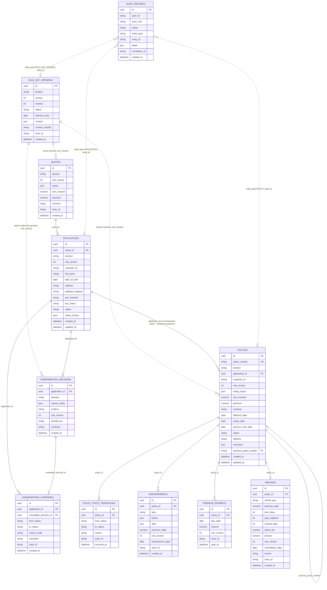

# Data Models — PolicyForge

Produced by `/design` (planner). Canonical names come from `docs/conventions.md` → "Persistence", "Lifecycle",
"Additional enums" and "Audit actions" and are used verbatim. Machine-readable twin:
[`data-models.schema.json`](data-models.schema.json) (JSON shapes of the same entities as they cross the API /
fixtures boundary — money as 2-decimal strings).

## 1. Conventions applied to every table

| Concern | Rule |
|---------|------|
| ORM | SQLAlchemy 2 declarative models, all in `backend/src/repository/models.py`; one repository per aggregate `src/repository/<entity>_repository.py` |
| Engine | SQLite (`sqlite:///./policyforge.db`, `Settings.database_url`); `PRAGMA foreign_keys=ON` set on connect |
| IDs | UUID4 stored as `String(36)` (SQLite has no native UUID) — column type written below as `UUID (String(36))`; generated by the service, never by the DB |
| Money | `Numeric(12, 2)` mapped to `decimal.Decimal` (`asdecimal=True`), quantized 0.01 `ROUND_HALF_UP` before insert. Never `Float` (NFR-01) |
| Rates | `Numeric(9, 6)`. **No v1 table has a rate column** — all rates live inside `rule_set_versions.content` as JSON strings and are parsed to `Decimal` by `src/config/rule_loader.py` |
| Dates | Business dates `Date` (`effective_date`, `due_date`, …); instants `DateTime(timezone=True)` in UTC (`created_at`, `occurred_at`, `paid_at`). Timestamps are supplied by the service from `src/lib/clock.py`, never by `server_default=now()` (keeps tests deterministic) |
| Enums | Stored as `String(n)` + a `CHECK (col IN (...))` constraint generated from the `src/types/enums.py` values (SQLite-safe, no native ENUM) |
| JSON | `JSON` columns (SQLite TEXT). Money inside JSON is always a 2-decimal string |
| Append-only | ✅ tables: repository exposes `add(...)` + reads only; a `before_flush` guard in `src/repository/append_only.py` raises `AppendOnlyViolationError` if a persistent instance of an append-only model is dirty or deleted (E1-S3 AC-5); migrations never `drop_*` them |
| Transactions | Repositories take a `Session` and never commit; services own the unit of work (`src/service/unit_of_work.py`) |
| PII | Only `aadhaar_masked` / `pan_masked` are stored. Raw Aadhaar, raw PAN and health-declaration `details` are **never persisted** (NFR-03) |

## 2. Entity overview

| # | Model | Table | Append-only | Owner story | Migration |
|---|-------|-------|-------------|-------------|-----------|
| 1 | `RuleSetVersion` | `rule_set_versions` | ✅ | E2-S2 | `0003_rule_set_versions` |
| 2 | `Quote` | `quotes` | — (insert-only in practice) | E3-S2 | `0004_quotes` |
| 3 | `Application` | `applications` | — (status projection) | E4-S2 | `0005_applications_underwriting_decisions` |
| 4 | `UnderwritingDecision` | `underwriting_decisions` | ✅ | E4-S2 | `0005_applications_underwriting_decisions` |
| 5 | `UnderwritingOverride` | `underwriting_overrides` | ✅ | E4-S4 | `0006_underwriting_overrides` |
| 6 | `Policy` | `policies` | — (current projection) | E5-S2 | `0007_policy_lifecycle` |
| 7 | `PolicyStateTransition` | `policy_state_transitions` | ✅ | E5-S2 | `0007_policy_lifecycle` |
| 8 | `Endorsement` | `endorsements` | ✅ | E5-S2 (table, model, repository — read by E5-S3), E6-S2 (writes) | `0007_policy_lifecycle` |
| 9 | `PremiumPayment` | `premium_payments` | ✅ | E5-S2 (table + first-term row), E7-S2 (renewal payments) | `0007_policy_lifecycle` |
| 10 | `Refund` | `refunds` | ✅ | E5-S2 (table, model, repository — read by E5-S3), E8-S2 (writes) | `0007_policy_lifecycle` |
| 11 | `AuditRecord` | `audit_records` | ✅ | E1-S3 | `0002_audit_records` |

Migration chain is strictly linear (one head, E1-S1 AC-4): `0001_baseline` → `0002_audit_records` →
`0003_rule_set_versions` → `0004_quotes` → `0005_applications_underwriting_decisions` →
`0006_underwriting_overrides` → `0007_policy_lifecycle` (policies, policy_state_transitions, premium_payments,
endorsements, refunds).
Files live in `backend/migrations/versions/` as `<rev>_<slug>.py` with `revision = "<rev>"` and
`down_revision` = the previous one. They are append-only (NFR-05).

## 3. ER diagram



Dotted lines are **logical** references enforced by services (no DB foreign key): `(product, rule_version)` points
at a `(product, version)` pair of `rule_set_versions`, which is not unique on its own because the table is
append-only (several rows per version); audit rows reference any entity polymorphically.

## 4. Enumerations (stored values)

All from `src/types/enums.py` (`docs/conventions.md`).

| Enum | Values | Used by column |
|------|--------|----------------|
| `ProductCode` | `TERM_LIFE`, `MOTOR`, `HOUSEHOLD` | every `product` |
| Rule-version status (literal, `RuleStatus` in `src/types/rules.py`) | `DRAFT`, `PUBLISHED` | `rule_set_versions.status` |
| `ApplicationStatus` | `SUBMITTED`, `UNDERWRITING`, `AUTO_BIND`, `MANUAL_REVIEW`, `DECLINED`, `ISSUED` | `applications.status`, `underwriting_overrides.from_status/to_status` |
| `Decision` | `AUTO_BIND`, `MANUAL_REVIEW`, `DECLINE` | `underwriting_decisions.decision` |
| `UnderwriterDecision` (request only) | `APPROVE` → stored `AUTO_BIND`, `DECLINE` → stored `DECLINE` | — (API body) |
| `PolicyStatus` | `ACTIVE`, `ENDORSED`, `LAPSED`, `CANCELLED`, `RENEWED` | `policies.status`, `policy_state_transitions.from_status/to_status` |
| `EndorsementType` | `CHANGE_ADDRESS`, `ADD_NOMINEE`, `CHANGE_SUM_INSURED` | `endorsements.type` |
| `RefundType` | `FREE_LOOK`, `PRO_RATA` | `refunds.refund_type` |
| `ActorRole` | `CUSTOMER`, `UNDERWRITER`, `ADMIN`, `SYSTEM` (internal, DEC-010) | `audit_records.actor_role` |
| `EndOfDayAction` | `NONE`, `RENEW`, `IN_GRACE`, `LAPSE` | — (domain result, not stored) |
| Audit action (literal, `AuditAction` in `src/types/enums.py`) | `RULE_VERSION_DRAFT_CREATED`, `RULE_VERSION_PUBLISHED`, `UW_APPROVE`, `UW_DECLINE`, `UW_OVERRIDE_DECLINE`, `POLICY_ISSUED`, `ENDORSEMENT_CREATED`, `POLICY_CANCELLED`, `RUN_END_OF_DAY` | `audit_records.action` |
| Audit entity type (literal) | `RULE_SET_VERSION`, `APPLICATION`, `POLICY`, `END_OF_DAY` | `audit_records.entity_type` |
| Nominee relationship (literal, endorsement spec) | `SPOUSE`, `CHILD`, `PARENT`, `SIBLING`, `OTHER` | `policies.nominees[].relationship` |
| Transition reason (free text, conventional values) | `ISSUED`, `RENEWAL_ISSUED`, `ENDORSEMENT:<EndorsementType>`, `RENEWED`, `GRACE_PERIOD_EXPIRED`, `CANCELLED:<reason>` | `policy_state_transitions.reason` |

`AuditAction`, the audit entity types and `RuleStatus` are not in the conventions enum list; they are the
conventions' literal value sets given a type name. See §8 (open points).

---

## 5. Entities

Legend: **N** = nullable. PK = primary key, FK = foreign key, UK = unique.

### 5.1 `RuleSetVersion` — `rule_set_versions` ✅ append-only

One row per state change of a `(product, version)`: create DRAFT, replace DRAFT (DEC-009 `PUT`), publish. The
current state of a version is its row with the highest `revision`. Owner: E2-S2 (repository), E2-S3 (service).

| Field | SQL type | N | Constraints / notes |
|-------|----------|---|---------------------|
| `id` | UUID (String(36)) | no | PK |
| `product` | String(16) | no | CHECK in `ProductCode` |
| `version` | Integer | no | CHECK `version >= 1` |
| `revision` | Integer | no | CHECK `revision >= 1`; 1 for the first row of a `(product, version)`, +1 per appended row (see §8-C1) |
| `status` | String(16) | no | CHECK in (`DRAFT`, `PUBLISHED`) |
| `effective_from` | Date | no | copied from `content.effective_from` |
| `content` | JSON | no | full rule-file body (money/rates as strings); validated against `backend/policy_rules/schema/rule-file.schema.json` before insert |
| `content_sha256` | String(64) | no | CHECK length 64, lowercase hex; for file imports equals the `PUBLISHED.lock` hash of the file bytes |
| `actor_id` | String(64) | no | admin id, or `SYSTEM` for seed/file import |
| `created_at` | DateTime(tz) | no | publish time of a PUBLISHED row |

Constraints and indexes:
- UK `uq_rule_set_versions_product_version_revision` on (`product`, `version`, `revision`) and partial UK
  `uq_rule_set_versions_published` on (`product`, `version`) WHERE `status = 'PUBLISHED'` (DEC-013, E2-S2 AC-2/AC-3):
  a DRAFT replace appends `revision + 1`, and a version can be published only once.
- IX `ix_rule_set_versions_product_version` on (`product`, `version`, `revision`) — latest-state lookup.
- Derived (repository, not stored): `latest_status(product, version)`, `active_for_product(product)` = highest
  `version` whose latest row is `PUBLISHED`; `list_for_product(product)`.

Relationships: logical parent of `quotes`, `underwriting_decisions`, `policies`, `endorsements`, `premium_payments`,
`refunds` via (`product`, `rule_version`).

Example (MOTOR v1 imported by the seed):

```json
{
  "id": "5b0f3c2e-1a4d-4c8e-9f10-000000000001",
  "product": "MOTOR",
  "version": 1,
  "revision": 1,
  "status": "PUBLISHED",
  "effective_from": "2026-01-01",
  "content": { "product": "MOTOR", "version": 1, "status": "PUBLISHED", "effective_from": "2026-01-01", "currency": "INR",
               "premium": { "base_rate": "0.0310", "minimum_premium": "2500.00", "factors": { "zone_rates": { "A": "1.05", "B": "1.00" }, "...": "..." } },
               "...": "..." },
  "content_sha256": "0c5a1f3e9b7d2a4c6e8f0a1b3c5d7e9f1a2b4c6d8e0f1a3b5c7d9e1f2a4b6c8d",
  "actor_id": "SYSTEM",
  "created_at": "2026-01-01T00:00:00Z"
}
```
(`content_sha256` above is illustrative; the real value is the `motor/v1.json` line of `PUBLISHED.lock`.)

### 5.2 `Quote` — `quotes` (mutable table, insert-only in practice)

Owner: E3-S2. Carries **no PII** (quote-engine spec).

| Field | SQL type | N | Constraints / notes |
|-------|----------|---|---------------------|
| `id` | UUID (String(36)) | no | PK; exposed as `quote_id` |
| `product` | String(16) | no | CHECK in `ProductCode` |
| `rule_version` | Integer | no | CHECK `>= 1`; the PUBLISHED version active at quote time |
| `inputs` | JSON | no | normalised canonical quote inputs (`docs/conventions.md` → Quote input fields); `sum_insured` kept as string |
| `sum_insured` | Numeric(12, 2) | no | CHECK `> 0`; denormalised from `inputs` |
| `premium` | Numeric(12, 2) | no | CHECK `> 0`; result of `calculate_premium` |
| `currency` | String(3) | no | CHECK `= 'INR'`; default `INR` |
| `actor_id` | String(64) | no | owning customer (`cust-001`) |
| `created_at` | DateTime(tz) | no | |

Indexes: IX (`actor_id`), IX (`product`, `rule_version`).

Example (E3-S2 AC-1 golden MOTOR quote):

```json
{
  "id": "7d7c2f0e-3b1a-4e5f-8a9b-000000000101",
  "product": "MOTOR",
  "rule_version": 1,
  "inputs": { "owner_age": 30, "sum_insured": "500000.00", "vehicle_age_years": 3, "engine_cc": 1200, "zone": "A", "ncb_percent": "20" },
  "sum_insured": "500000.00",
  "premium": "14322.00",
  "currency": "INR",
  "actor_id": "cust-001",
  "created_at": "2026-03-01T09:00:00Z"
}
```
(500000.00 × 0.0310 × 1.00 × 1.10 × 1.05 × (1 − 0.20) = 14322.00.)

### 5.3 `Application` — `applications` (status projection)

Owner: E4-S2; status changed by E4-S3 (decision), E4-S4 (override), E5-S2 (`AUTO_BIND → ISSUED`).

| Field | SQL type | N | Constraints / notes |
|-------|----------|---|---------------------|
| `id` | UUID (String(36)) | no | PK; exposed as `application_id` |
| `quote_id` | UUID (String(36)) | no | FK → `quotes.id` |
| `product` | String(16) | no | CHECK in `ProductCode`; = quote product |
| `rule_version` | Integer | no | version the automatic decision used (= quote version; stale quote → 409 `QUOTE_STALE`) |
| `customer_id` | String(64) | no | owner (`X-Actor-Id` of the submitting CUSTOMER) |
| `full_name` | String(200) | no | synthetic (`Test Customer 01`) |
| `date_of_birth` | Date | no | |
| `address` | String(300) | no | copied to `policies.address` at issuance |
| `aadhaar_masked` | String(14) | no | CHECK pattern `XXXX-XXXX-dddd`; raw value never stored |
| `pan_masked` | String(10) | no | CHECK pattern `XXXXXddddX`; raw value never stored |
| `kyc_status` | String(16) | no | CHECK in (`VERIFIED`) — stub always verifies a valid KYC (E4-S1 AC-1) |
| `status` | String(16) | no | CHECK in `ApplicationStatus` |
| `status_history` | JSON | no | ordered list of `ApplicationStatus` strings, e.g. `["SUBMITTED","UNDERWRITING","AUTO_BIND"]` (E4-S2 AC-4); appended in the same transaction as each status change |
| `created_at` | DateTime(tz) | no | queue ordering (oldest first) |
| `updated_at` | DateTime(tz) | no | |

Indexes: IX (`status`, `created_at`) — underwriting queue; IX (`customer_id`); IX (`quote_id`).
Health declaration: `has_pre_existing_condition` is consumed by underwriting (derived field) and its effect is
recorded as reason code `TL-UW-003` on the decision; neither the flag nor `details` is stored (NFR-03, §8-A2).

Example (AUTO_BIND application for the golden quote):

```json
{
  "id": "a1b2c3d4-0000-4000-8000-000000000201",
  "quote_id": "7d7c2f0e-3b1a-4e5f-8a9b-000000000101",
  "product": "MOTOR",
  "rule_version": 1,
  "customer_id": "cust-001",
  "full_name": "Test Customer 01",
  "date_of_birth": "1996-04-01",
  "address": "1 Sample Street, Testville",
  "aadhaar_masked": "XXXX-XXXX-0001",
  "pan_masked": "XXXXX0001X",
  "kyc_status": "VERIFIED",
  "status": "AUTO_BIND",
  "status_history": ["SUBMITTED", "UNDERWRITING", "AUTO_BIND"],
  "created_at": "2026-03-01T09:05:00Z",
  "updated_at": "2026-03-01T09:05:00Z"
}
```

### 5.4 `UnderwritingDecision` — `underwriting_decisions` ✅ append-only

Owner: E4-S2 (automatic, `decided_by = "SYSTEM"`), E4-S3 (underwriter). A case's current decision is its latest row.

| Field | SQL type | N | Constraints / notes |
|-------|----------|---|---------------------|
| `id` | UUID (String(36)) | no | PK |
| `application_id` | UUID (String(36)) | no | FK → `applications.id` |
| `decision` | String(16) | no | CHECK in `Decision` |
| `reason_codes` | JSON | no | list of codes sorted ascending; `[]` iff `AUTO_BIND` by SYSTEM; every code ∈ the version's `underwriting.reason_codes` (service-enforced) |
| `product` | String(16) | no | CHECK in `ProductCode` |
| `rule_version` | Integer | no | CHECK `>= 1` |
| `decided_by` | String(64) | no | `SYSTEM` or underwriter actor id (`uw-001`) |
| `comment` | String(500) | yes | underwriter comment; null for SYSTEM |
| `created_at` | DateTime(tz) | no | |

Indexes: IX (`application_id`, `created_at`).

Examples:

```json
[
  { "id": "d0000000-0000-4000-8000-000000000301", "application_id": "a1b2c3d4-0000-4000-8000-000000000202",
    "decision": "MANUAL_REVIEW", "reason_codes": ["MO-UW-002"], "product": "MOTOR", "rule_version": 1,
    "decided_by": "SYSTEM", "comment": null, "created_at": "2026-03-02T10:00:00Z" },
  { "id": "d0000000-0000-4000-8000-000000000302", "application_id": "a1b2c3d4-0000-4000-8000-000000000202",
    "decision": "AUTO_BIND", "reason_codes": ["MO-UW-900"], "product": "MOTOR", "rule_version": 1,
    "decided_by": "uw-001", "comment": "Vehicle inspected", "created_at": "2026-03-02T11:30:00Z" }
]
```

### 5.5 `UnderwritingOverride` — `underwriting_overrides` ✅ append-only

Owner: E4-S4. Written in the same transaction as the application status change and the audit row.

| Field | SQL type | N | Constraints / notes |
|-------|----------|---|---------------------|
| `id` | UUID (String(36)) | no | PK |
| `application_id` | UUID (String(36)) | no | FK → `applications.id` |
| `overridden_decision_id` | UUID (String(36)) | no | FK → `underwriting_decisions.id` (the latest `DECLINE` row) |
| `from_status` | String(16) | no | CHECK `= 'DECLINED'` |
| `to_status` | String(16) | no | CHECK `= 'AUTO_BIND'` |
| `reason_code` | String(9) | no | CHECK pattern `^(TL|MO|HH)-UW-\d{3}$`; ∈ the case's rule-version `reason_codes` (service) |
| `comment` | String(500) | no | CHECK `length(comment) BETWEEN 10 AND 500` |
| `actor_id` | String(64) | no | admin id |
| `created_at` | DateTime(tz) | no | |

Indexes: IX (`application_id`).

Example (E4-S4 AC-2):

```json
{ "id": "e0000000-0000-4000-8000-000000000401", "application_id": "a1b2c3d4-0000-4000-8000-000000000203",
  "overridden_decision_id": "d0000000-0000-4000-8000-000000000303", "from_status": "DECLINED", "to_status": "AUTO_BIND",
  "reason_code": "MO-UW-901", "comment": "Vehicle restored and certified roadworthy", "actor_id": "admin-001",
  "created_at": "2026-03-03T15:00:00Z" }
```

### 5.6 `Policy` — `policies` (current projection)

Owner: E5-S2 (insert at issuance), E6-S2 (attributes + status), E7-S3/E7-S4 (status + successor insert),
E8-S2 (status). Every status change goes through `src/domain/policy_state_machine.transition` and appends a
`policy_state_transitions` row in the same transaction.

| Field | SQL type | N | Constraints / notes |
|-------|----------|---|---------------------|
| `id` | UUID (String(36)) | no | PK |
| `policy_number` | String(14) | no | **UK**; CHECK pattern `^(TL|MO|HH)-\d{4}-\d{6}$`; `YYYY` = year of `effective_date`, sequence per prefix+year allocated in the issuing transaction |
| `product` | String(16) | no | CHECK in `ProductCode` |
| `application_id` | UUID (String(36)) | no | FK → `applications.id`; successors keep the originating application (source of masked KYC) |
| `customer_id` | String(64) | no | owner |
| `rule_version` | Integer | no | version the term was priced on (issuance: quote version; renewal: active version at renewal) |
| `rating_inputs` | JSON | no | canonical quote inputs for this term (renewal: ages/`vehicle_age_years` advanced by 1; `CHANGE_SUM_INSURED` updates `sum_insured`) |
| `sum_insured` | Numeric(12, 2) | no | CHECK `> 0` |
| `premium` | Numeric(12, 2) | no | CHECK `> 0`; full-term annual premium |
| `currency` | String(3) | no | CHECK `= 'INR'` |
| `effective_date` | Date | no | business date of issuance / `previous.expiry_date + 1` |
| `expiry_date` | Date | no | `effective_date + term_months − 1 day`; CHECK `expiry_date > effective_date` |
| `premium_due_date` | Date | no | = `effective_date` (first-term premium paid at issuance). `next_premium_due_date` = `expiry_date + 1` is derived, not stored |
| `status` | String(16) | no | CHECK in `PolicyStatus` |
| `address` | String(300) | no | insured address (from application; `CHANGE_ADDRESS`) |
| `nominees` | JSON | no | list `[{nominee_name, relationship, share_percent}]` (`share_percent` decimal string, total ≤ 100); default `[]` |
| `previous_policy_number` | String(14) | yes | **UK** (backstop against a second successor, AC-18); FK → `policies.policy_number`; null = new business (free look applies) |
| `created_at` | DateTime(tz) | no | |
| `updated_at` | DateTime(tz) | no | |

Constraints and indexes:
- UK `uq_policies_policy_number` (`policy_number`), UK `uq_policies_previous_policy_number` (`previous_policy_number`).
- Partial UK `uq_policies_new_business_application` on (`application_id`) WHERE `previous_policy_number IS NULL` —
  an application issues at most one policy.
- IX (`customer_id`), IX (`status`, `expiry_date`) — end-of-day scan and dashboard, IX (`product`, `status`).

Example (E5-S2 AC-1 golden, after issuance on 2026-03-01; premium 500000.00 × 0.0310 × 1.00 × 1.00 × 1.00 × 1.00 = 15500.00):

```json
{
  "id": "b0000000-0000-4000-8000-000000000501",
  "policy_number": "MO-2026-000001",
  "product": "MOTOR",
  "application_id": "a1b2c3d4-0000-4000-8000-000000000204",
  "customer_id": "cust-001",
  "rule_version": 1,
  "rating_inputs": { "owner_age": 30, "sum_insured": "500000.00", "vehicle_age_years": 2, "engine_cc": 998, "zone": "B", "ncb_percent": "0" },
  "sum_insured": "500000.00",
  "premium": "15500.00",
  "currency": "INR",
  "effective_date": "2026-03-01",
  "expiry_date": "2027-02-28",
  "premium_due_date": "2026-03-01",
  "status": "ACTIVE",
  "address": "1 Sample Street, Testville",
  "nominees": [],
  "previous_policy_number": null,
  "created_at": "2026-03-01T09:10:00Z",
  "updated_at": "2026-03-01T09:10:00Z"
}
```

### 5.7 `PolicyStateTransition` — `policy_state_transitions` ✅ append-only

Owner: E5-S2 (issuance), E6-S2, E7-S3/E7-S4, E8-S2.

| Field | SQL type | N | Constraints / notes |
|-------|----------|---|---------------------|
| `id` | UUID (String(36)) | no | PK |
| `policy_id` | UUID (String(36)) | no | FK → `policies.id` |
| `from_status` | String(16) | yes | CHECK in `PolicyStatus`; NULL only for creation (issuance / renewal successor) |
| `to_status` | String(16) | no | CHECK in `PolicyStatus` |
| `reason` | String(64) | no | `ISSUED`, `RENEWAL_ISSUED`, `ENDORSEMENT:<type>`, `RENEWED`, `GRACE_PERIOD_EXPIRED`, `CANCELLED:<reason>` |
| `actor_id` | String(64) | no | customer, admin or `system-eod` |
| `occurred_at` | DateTime(tz) | no | canonical name (E5-S2 AC-4) |

Constraints: CHECK `(from_status IS NULL AND to_status = 'ACTIVE') OR from_status IS NOT NULL`.
Indexes: IX (`policy_id`, `occurred_at`).

Example: `{ "id": "c0000000-0000-4000-8000-000000000601", "policy_id": "b0000000-0000-4000-8000-000000000501", "from_status": null, "to_status": "ACTIVE", "reason": "ISSUED", "actor_id": "cust-001", "occurred_at": "2026-03-01T09:10:00Z" }`

### 5.8 `Endorsement` — `endorsements` ✅ append-only

Owner: E5-S2 creates table/model/repository (Policy Detail reads it in E5-S3); E6-S2 writes rows.

| Field | SQL type | N | Constraints / notes |
|-------|----------|---|---------------------|
| `id` | UUID (String(36)) | no | PK |
| `policy_id` | UUID (String(36)) | no | FK → `policies.id` |
| `type` | String(24) | no | CHECK in `EndorsementType`; must be in the version's `endorsement.allowed_types` (service) |
| `before` | JSON | no | changed attributes before (e.g. `{"address": …}`, `{"sum_insured": "500000.00", "premium": "15500.00"}`, `{"nominees": [...]}`) |
| `after` | JSON | no | same keys, after |
| `premium_delta` | Numeric(12, 2) | no | may be negative; `0.00` for `CHANGE_ADDRESS` / `ADD_NOMINEE`; not collected |
| `rule_version` | Integer | no | = `policies.rule_version` at endorsement time |
| `endorsement_date` | Date | no | business date; CHECK not enforced in DB — service checks `effective_date ≤ d ≤ expiry_date` |
| `actor_id` | String(64) | no | |
| `created_at` | DateTime(tz) | no | history order (oldest first) |

Indexes: IX (`policy_id`, `created_at`).

Example (E6-S3 AC-4 numbers: business date 2026-09-01, 181 unused of 365 days; (18600.00 − 15500.00) × 181 / 365 = 1537.26):

```json
{ "id": "f0000000-0000-4000-8000-000000000701", "policy_id": "b0000000-0000-4000-8000-000000000501",
  "type": "CHANGE_SUM_INSURED",
  "before": { "sum_insured": "500000.00", "premium": "15500.00" },
  "after":  { "sum_insured": "600000.00", "premium": "18600.00" },
  "premium_delta": "1537.26", "rule_version": 1, "endorsement_date": "2026-09-01",
  "actor_id": "cust-001", "created_at": "2026-09-01T10:00:00Z" }
```

### 5.9 `PremiumPayment` — `premium_payments` ✅ append-only

Owner: E5-S2 (table + first-term payment at issuance), E7-S2 (renewal payments).

| Field | SQL type | N | Constraints / notes |
|-------|----------|---|---------------------|
| `id` | UUID (String(36)) | no | PK |
| `policy_id` | UUID (String(36)) | no | FK → `policies.id` (renewal payments are recorded on the **current** policy) |
| `due_date` | Date | no | first term: `effective_date`; renewal: `expiry_date + 1` |
| `amount` | Numeric(12, 2) | no | CHECK `> 0`; must equal the quoted premium (service → `AMOUNT_MISMATCH`) |
| `rule_version` | Integer | no | version the premium was priced on (renewal: active version at quote time; successor uses it) |
| `actor_id` | String(64) | no | |
| `paid_at` | DateTime(tz) | no | |

Constraints: UK `uq_premium_payments_policy_due` (`policy_id`, `due_date`) — second payment → `PremiumAlreadyPaidError`
(409 `PREMIUM_ALREADY_PAID`). Indexes: IX (`due_date`).

Examples: first term `{ "id": "90000000-0000-4000-8000-000000000801", "policy_id": "b0000000-0000-4000-8000-000000000501", "due_date": "2026-03-01", "amount": "15500.00", "rule_version": 1, "actor_id": "cust-001", "paid_at": "2026-03-01T09:10:00Z" }`;
renewal (E7-S2 AC-1) `{ …, "due_date": "2027-03-01", "amount": "15500.00", "rule_version": 1, "paid_at": "2027-02-10T08:00:00Z" }`.

### 5.10 `Refund` — `refunds` ✅ append-only

Owner: E5-S2 creates table/model/repository (Policy Detail reads it in E5-S3); E8-S2 writes rows. At most one refund
per policy (cancellation is terminal).

| Field | SQL type | N | Constraints / notes |
|-------|----------|---|---------------------|
| `id` | UUID (String(36)) | no | PK |
| `policy_id` | UUID (String(36)) | no | FK → `policies.id`; **UK** |
| `refund_type` | String(16) | no | CHECK in `RefundType` |
| `premium_paid` | Numeric(12, 2) | no | CHECK `> 0`; payment covering the current term |
| `term_days` | Integer | no | CHECK `> 0` |
| `days_elapsed` | Integer | no | CHECK `>= 0` |
| `unused_days` | Integer | no | CHECK `unused_days = term_days - days_elapsed` |
| `admin_fee` | Numeric(12, 2) | no | CHECK `>= 0`; `0.00` for `FREE_LOOK` |
| `amount` | Numeric(12, 2) | no | CHECK `amount >= 0 AND amount <= premium_paid` |
| `rule_version` | Integer | no | policy's version |
| `cancellation_date` | Date | no | within the term (service → `OUTSIDE_TERM`) |
| `reason` | String(200) | no | e.g. `NO_LONGER_NEEDED`, `Vehicle sold` |
| `actor_id` | String(64) | no | |
| `created_at` | DateTime(tz) | no | |

Example (E8-S1/E8-S2 golden `TL-2026-000001`, 12000.00 × 275 / 365 − 250.00 = 8791.10):

```json
{ "id": "80000000-0000-4000-8000-000000000901", "policy_id": "b0000000-0000-4000-8000-000000000502",
  "refund_type": "PRO_RATA", "premium_paid": "12000.00", "term_days": 365, "days_elapsed": 90, "unused_days": 275,
  "admin_fee": "250.00", "amount": "8791.10", "rule_version": 1, "cancellation_date": "2026-04-01",
  "reason": "NO_LONGER_NEEDED", "actor_id": "cust-001", "created_at": "2026-04-01T12:00:00Z" }
```

### 5.11 `AuditRecord` — `audit_records` ✅ append-only

Owner: E1-S3. Written for every UNDERWRITER/ADMIN action and the scheduler; `detail` never contains PII.

| Field | SQL type | N | Constraints / notes |
|-------|----------|---|---------------------|
| `id` | UUID (String(36)) | no | PK |
| `actor_id` | String(64) | no | |
| `actor_role` | String(16) | no | CHECK in `ActorRole` |
| `action` | String(32) | no | CHECK in the 9 audit actions |
| `entity_type` | String(24) | no | CHECK in (`RULE_SET_VERSION`, `APPLICATION`, `POLICY`, `END_OF_DAY`) |
| `entity_id` | String(64) | no | id / policy number / `as_of` date |
| `detail` | JSON | yes | e.g. override `{reason_code, comment}`, end-of-day `{as_of, renewed, lapsed, in_grace, not_renewable, failed}` |
| `correlation_id` | String(64) | yes | request `X-Correlation-ID` |
| `created_at` | DateTime(tz) | no | |

Indexes: IX (`entity_type`, `entity_id`, `created_at`) — `list_for_entity` oldest first; IX (`action`).

Example (E4-S4 AC-3):

```json
{ "id": "70000000-0000-4000-8000-000000001001", "actor_id": "admin-001", "actor_role": "ADMIN",
  "action": "UW_OVERRIDE_DECLINE", "entity_type": "APPLICATION", "entity_id": "a1b2c3d4-0000-4000-8000-000000000203",
  "detail": { "reason_code": "MO-UW-901", "comment": "Vehicle restored and certified roadworthy" },
  "correlation_id": "corr-admin-1", "created_at": "2026-03-03T15:00:00Z" }
```

## 6. Relationship summary

| From | To | Cardinality | Enforcement |
|------|----|-------------|-------------|
| `applications.quote_id` | `quotes.id` | N:1 | FK |
| `underwriting_decisions.application_id` | `applications.id` | N:1 (≥ 1 per submitted application) | FK |
| `underwriting_overrides.application_id` / `overridden_decision_id` | `applications.id` / `underwriting_decisions.id` | N:1 / 1:0..1 | FK |
| `policies.application_id` | `applications.id` | 1 new-business policy per application (+ successors) | FK + partial UK |
| `policies.previous_policy_number` | `policies.policy_number` | 0..1 : 0..1 (renewal chain) | FK + UK |
| `policy_state_transitions.policy_id` | `policies.id` | N:1 (≥ 1) | FK |
| `endorsements.policy_id` | `policies.id` | N:1 | FK |
| `premium_payments.policy_id` | `policies.id` | N:1 (≥ 1), one per due date | FK + UK |
| `refunds.policy_id` | `policies.id` | 0..1 : 1 | FK + UK |
| `(product, rule_version)` on quotes/decisions/policies/endorsements/payments/refunds | `rule_set_versions (product, version)` | N:1 | service (logical) |
| `audit_records (entity_type, entity_id)` | any entity | N:1 | logical |

## 7. Read models (derived, not stored)

| Read model | Source | Used by |
|------------|--------|---------|
| Active version per product | `rule_set_versions` latest row per (product, version) | E2-S3, E3-S2, E7-S1 |
| `next_premium_due_date` = `expiry_date + 1` | `policies` | E5-S3 |
| Renewal due / grace end | `policies.expiry_date` + rule `renewal.grace_period_days` | E7-S1/S3, E9-S1 |
| `is_paid(policy, due_date)` | `premium_payments` UK lookup | E7-S2, E7-S3, E9-S1 |
| Portfolio summary | `policies`, `premium_payments`, `refunds`, `rule_set_versions` | E9-S1 |

## 8. Assumptions and open points (flag for human review)

- **C1 — `rule_set_versions` unique key vs DEC-009 — RESOLVED (DEC-013).** `revision` (int, +1 per appended row)
  with UK (`product`, `version`, `revision`) and partial UK (`product`, `version`) WHERE `status = 'PUBLISHED'`.
  A DRAFT replace appends `revision + 1`; "published once" is enforced in the DB. E2-S2 AC-2/AC-3 now say this.
- **C2 — `quotes.inputs` vs `input` — RESOLVED.** The column and the request body field are **`inputs`**
  (E3-S2 AC-5 corrected).
- **C3 — transition timestamp name — RESOLVED.** The column is **`occurred_at`** (E5-S2 AC-4 corrected).
- **C4 — `premium_payments` ownership.** The conventions endpoint table attributes payments to E7-S2, but E5-S2
  (sprint 3) must already write the first-term payment, so the table, model and append-only repository are
  created in E5-S2's migration `0007`; E7-S2 only adds the payment service and `is_paid` reads.
- **C6 — `endorsements` / `refunds` needed before their owner stories.** E5-S3 AC-2 seeds a policy with endorsements
  and the policy-issuance spec's Policy Detail returns `refunds[]`, but E5-S3 runs in parallel with E6-S2 (S3-C)
  and before E8-S2 (S4-B). Both tables, models and append-only repositories are therefore created by E5-S2 in
  `0007_policy_lifecycle` (its group's only migration); E6-S2 / E8-S2 add the writing services.
- **C5 — migration chain in sprint 1 — RESOLVED (DEC-014).** Only one story per group may add an Alembic migration
  (single head). E1-S3 owns `0002` in S1-B; E2-S2 moves to **S1-C** with `0003` (`down_revision = "0002"`) and now
  depends on `E1-S1, E1-S3, E2-S1`. E2-S3 shifts to S1-D and E2-S4 to S1-E.
- **A1 — IDs as `String(36)`** because SQLite lacks a UUID type; values are UUID4 strings (conventions).
- **A2 — health declaration not stored.** Its only persisted effect is reason code `TL-UW-003` on the decision.
- **A3 — `AuditAction`, audit entity types, `RuleStatus`, nominee relationships** are value sets already fixed in
  conventions/specs; they get type names here and should be added to `docs/conventions.md` → "Additional enums".
- **A4 — business date (DEC-012).** Every layer reads "today" from `src/lib/clock.py::today()`, which honours the
  `business_date` setting (env `POLICYFORGE_BUSINESS_DATE`); no column stores a business-date override, and
  E1-S4 AC-6 fails the build if any module outside `src/lib/clock.py` calls `date.today()` / `datetime.now()`.
